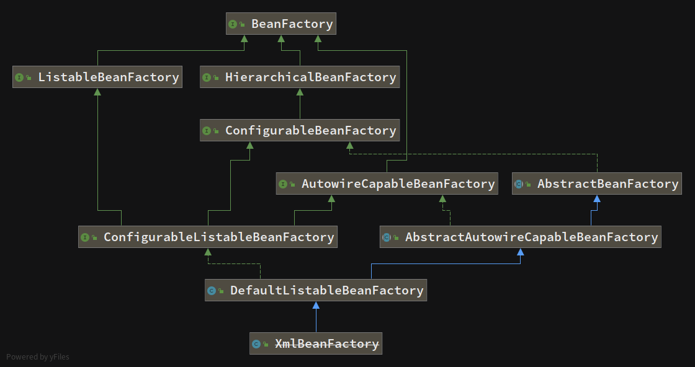
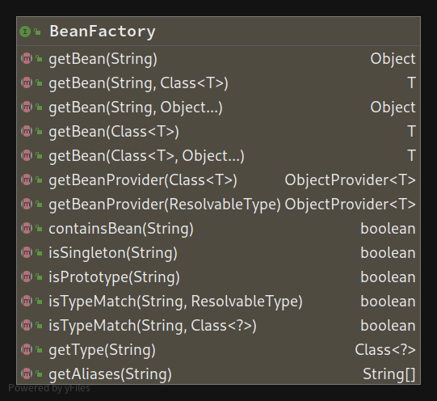
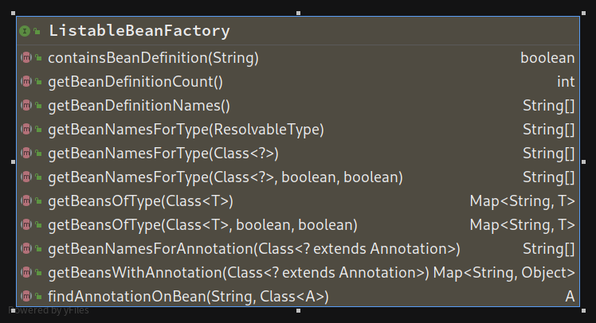
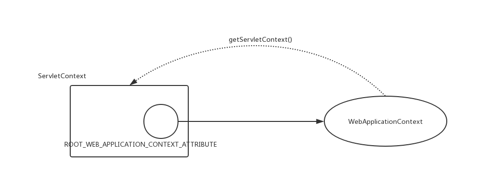
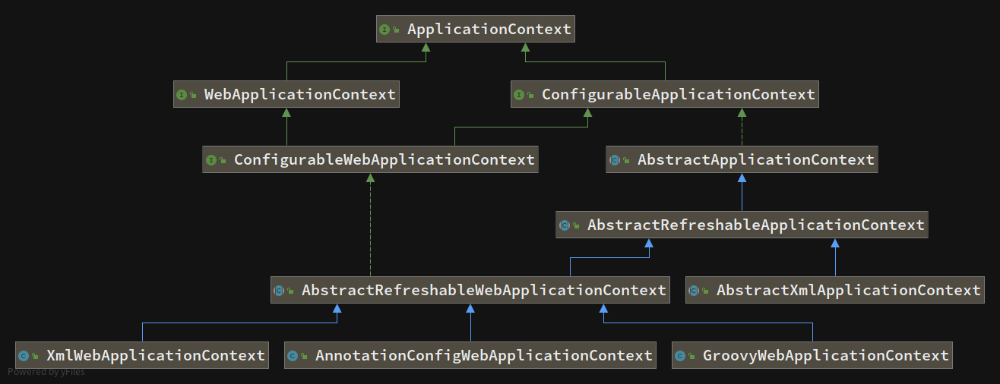

# BeanFactory

   Spring通过配置文件描述Bean与Bean之间的依赖关系，利用Java语言的反射功能实例化Bean。Spring的IoC容器在完成这些底层工作的基础上，还提供了Bean实例缓存、生命周期管理、时间发、资源装载等高级服务。

   Bean工厂(`com.springframework.beans.factory.BeanFactory`)是Spring框架最核心的接口，它提供了高级IoC的配置机制。`BeanFactory`使管理不同类型的Java对象成为可能，应用程序上下文（`com.springframework.context.ApplicationContext`）建立在`BeanFactory`基础之上，提供了更多面向应用的功能，提供了国际化支持和框架事件体系，更易于创建实际应用。一般称`BeanFactory`为IoC容器，称`ApplicationContext`为应用程序上下文。但有时为了方便，也称`ApplicationContext`为Spring容器。

​    对于两者一个简单的根据用途的不同的区分是：

- `BenaFactory`是Spring框架的基础设施，面向Spring本身.
- `ApplicationContext`面向使用Spring框架的开发者。

## BeanFactory简介

`BeanFactory`是一个类工厂，与传统的类工厂不同的是：传统的类工厂仅负责构造一个或几个类的实例；而`BeanFactory`是类的通用工厂，它可以创建并管理各种类的对象。这些被创建和管理的对象本身没有任何特别之处，仅是一个POJO，Spring称这些被创建和管理的Java对象为Bean，而普通的JavaBean是要满足一定规范的，Bean比JabaBean更宽泛一些，所有可以被Spring容器实例化并管理的Java类都可以成为Bean。

JavaBean的基本特征：

- 默认共有构造方法
- getter, setter（属性private）
- 序列化等等

参考StackOverFlow[What is the difference between a JavaBean and a POJO?](https://stackoverflow.com/questions/1394265/what-is-the-difference-between-a-javabean-and-a-pojo)

### BeanFactory的类体系结构

Spring提供了多种`BeanFactory`的实现，最常用的是`XmlBeanFactory`，在Spring3.2中被废弃。



#### BeanFactory接口

`BeanFactory`为基础接口，其方法列表如下：



该接口最主要的功能是`getBean(String)`返回指定名称的Bean。

#### ListableBeanFactory接口

方法列表如下：



该接口定义了访问容器中Bean基本信息的若干方法，如查看Bean的个数、获取某一类型Bean的配置是名、查看容器是否包含某一Bean等。

#### HierachicalBeanFactory接口

方法列表如下：


父子级联Ioc容器的接口，子容器可以通过接口方法访问父容器

#### ConfigurableBeanFactory接口

该接口增强了容器的可定制性，定义了设置类装载器、属性编辑器、容器初始化后置处理器等方法。

#### AutowireCapableBeanFactory接口

定义了将容器中的Bean按某种规则进行自动装配的方法。

#### SingleBeanRegistry接口

定义了允许运行期想容器注册单实例Bean方法。

#### BeanDefinitionRegistry接口

Spring配置文件中的每一个`<bean>`节点元素在Spring容器中都通过一个`BeanDefinition`对象表示，它描述了Bean的配置信息。而`BeanDefinitionRegistry`接口提供了向容器手工注册`BeanDefinition`对象的方法。

# ApplicationContext

`ApplicationContext`由`BeanFactory`派生而来，提供了更多面向实际应用的功能。在`BeanFactory`中，很多功能需要以编程的方式实现，而在`ApplicationContext`中可以使用配置的方式实现。

## ApplicationContext简介

### ApplicationContext类体系结构

`ApplicationContext`的主要实现是`ClassPathXmlApplicationContext`和`FileSystemXmlApplicationContext`，前者默认从类路径加载配置文件，后者默认从文件系统装载配置文件。

#### ApplicationEventPublisher接口

让容器拥有发布应用上下文事件的功能，包括启动事件、关闭事件等。实现`ApplicationListener`事件监听接口的Bean可以接收到容器事件，并对事件进行响应处理。在`ApplicationContext`抽象实现类`AbstractApplicationContext`中存在一个`ApplicationEventMulticaster`，它负责保存所有的监听器，以便在容器产生上下文事件时通知这些事件监听者。

#### MessageSource

#### ResourcePatternResolver

#### LifeCycle


### ApplicationContext类使用方法

`ApplicationContext`可以使用两种方法加载配置文件，分别是`ClassPathXmlApplicationContext`和`FileSystemXmlApplicationContext`。

```java
ApplicationContext ctxClassPath = 
    new ClassPathXmlApplicationContext("com/config/spring-application-context.xml");
// 对于ClassPathApplicationContext来说，
// "com/config/spring-application-context.xml"相当于
// "classpath:com/config/spring-application-context.xml"
ApplicationContext ctxFileSystem = 
    new FileSystemXmlApplicationContext("com/config/spring-application-context.xml");
// FileSystemXmlApplicationContext来说，
// "com/config/spring-application-context.xml"相当于
// "file:com/config/spring-application-context.xml"
ApplicationContext ctxClassPath2 = 
    new ClassPathXmlApplicationContext(
    new String[]{
        "config1.xml",
        "config2.xml"
    });
// 将多个配置文件整合起来
```

同时这两种方法都可以显示使用带资源类型前缀的路径，区别在于如果不显示指定资源前缀将分别默认解析为classpath和file。

在获取`ApplicationContext`后，就可以像`BeanFactory`一样调用`getBean(beanName)`返回Bean了。`ApplicationContext`的初始化和`BeanFactory`有一个重大区别就是：

- `BeanFactory`在初始化容器时，并未实例化Bean，直到第一次某个Bean被访问时才实例化目标Bean；
- `ApplicationContext`的在初始化应用上下文时就实例化所有单实例Bean。

### 使用注解配置Bean

`@Configuration`注解标明该类为一个配置类

`@Bean`注解指示了从该方法可以获取到Bean

```java
@Configuration
public class Beans{
    
    @Bean(name = "instance")
    public Instance createInstance(){
        return new Instance();
    }
}
```

同时Spring为基于注解类的配置提供了专门的`ApplicationContext`实现类：`AnnotationConfigApplicationCOntext`。下面是一个简单的示例：

```java
public class AnnotationConfigApplicationContextTest{
    
    @Test
    public void createInstance(){
        ApplicationContext ctxAnnotationConfig = 
        	new AnnotationConfigApplicationContext(Beans.class);
        	Instance instance = ctxAnnotationConfig.createInstance();
    }
}
```

### 使用Groovy配置Bean

Spring4.0 支持使用Groovy DSL来进行Bean定义配置。这种配置方式与XML文件的配置类似，只不过基于Groovy脚本语言，可以实现复杂、灵活的Bean配置逻辑，如下是一个例子：

```java
// groovy-beans.groovy
import com.bag.Instance;
beans{
    instance(Instance){
        name = "";
        properties = "";
        // ..
    }
}
```

同样，Spring为基于Groovy的配置提供了专门的`ApplicationContext`实现类：`GenericCrovvyApplicationContext`，如下是一个简单示例：

```java
public class GenericGrovvyApplicationContextTest{
    @Test
    public void createInstance(){
        ApplicationContext ctxGroovy =
            new GenericGroovyApplicationContext(
            	"classpath: groovy-beans.groovy");
        Instance instance = (Instance)ctxGroovy.createInstance("car");
    }
}
```

## WebApplicationContext简介

`WebApplicationContext`是专门为Web应用准备的，它允许从相对于web根目录的路径中装载配置文件完成初始化工作。从`WebApplicationCOntext`中可以获得`ServletContext`的引用，这个包房费Web应用上下文对象将作为属性防止在`ServletContext`中，以便Web应用环境可以访问Spring应用上下文。Spring提供了一个工具类`WebApplicationContextUtils`，通过该类的`getWebApplication(ServletContext sc)`方法，可以从`WebApplicationContext`获取`WebApplication`实例。

在非Web环境下，Bean只有sington和prototype两种作用域。`WebApplicationContext`为Bean添加了三个新的作用域：request、session和global session。

```java
// WebApplicationContext.java
public interface WebApplicationContext extends ApplicationContext {
    String ROOT_WEB_APPLICATION_CONTEXT_ATTRIBUTE = WebApplicationContext.class.getName() + ".ROOT";
    String SCOPE_REQUEST = "request";
    String SCOPE_SESSION = "session";
    String SCOPE_APPLICATION = "application";
    String SERVLET_CONTEXT_BEAN_NAME = "servletContext";
    String CONTEXT_PARAMETERS_BEAN_NAME = "contextParameters";
    String CONTEXT_ATTRIBUTES_BEAN_NAME = "contextAttributes";

    @Nullable
    ServletContext getServletContext();
}
```

上述代码中定义了一个常量：`ROOT_WEB_APPLICATION_CONTEXT_ATTRIBUTE`，在上下文启动时`WebApplicationContext`实例以此为key放置在`ServletContext`的属性列表中，前面提到`WebApplicationContextUtils`工具类拥有从Web容器获取`WebApplicationContext`的方法`getWebApplicationContext(ServletContext sc)`。

```java
// WebApplicationContextUtils.getWebApplicationContext(ServletContext sc)
public static WebApplicationContext getWebApplicationContext(ServletContext sc) {
    return getWebApplicationContext(sc, WebApplicationContext.ROOT_WEB_APPLICATION_CONTEXT_ATTRIBUTE);
}
```

上述方法便是`WebApplicationContextUtils`中获取`WebApplicationContext`的内部实现。

这样Spring的Web应用上下文和Web容器的上下文应用就实现了互相访问，二者实现了融合。



`ConfigurableWebApplicationContext`继承于`WebApplicationContext`，允许通过配置的方法实例化`WebApplicationContext`，同时定义了两个重要的方法。

```java
void setServletContext(@Nullable ServletContext var1);
void setConfigLocations(String... var1);
```

- `setServletContext`为Spring设置Web应用上下文，以便二者整合。
- `setConfigLocations`设置Spring配置文件地址。

### WebApplicationContext类体系结构



