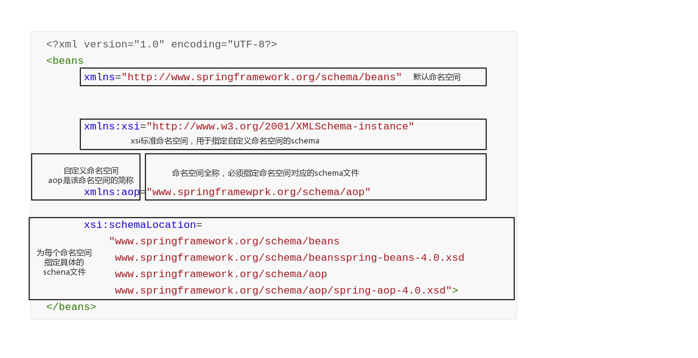
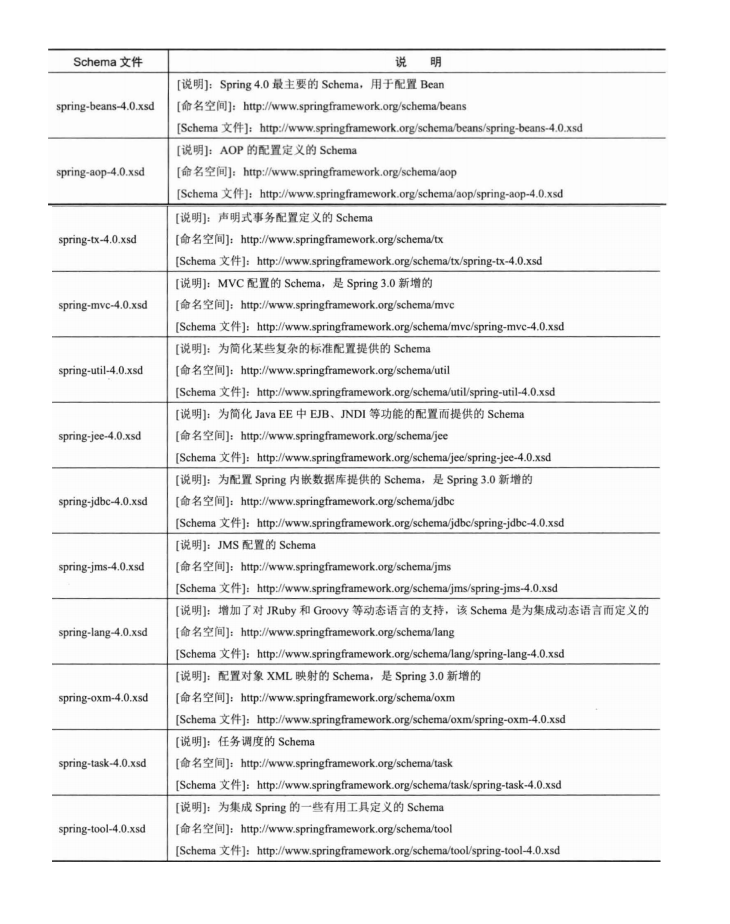

# 使用XML配置Spring

对于基于XML的配置，Spring 1.0 的配置文件采用DTD格式，Spring 2.0 以后采用Schema格式，后者让不同类型的配置拥有自己的命名空间，使得配置文件更具有扩展性。

采用基于Schema的配置方式，文件头生命会较为复杂，下面是一个简单的示例，如下：

```xml
<?xml version="1.0" encoding="UTF-8?>
<beans
      xmlns="http://www.springframework.org/schema/beans"
       
       
      xmlns:xsi="http://www.w3.org/2001/XMLSchema-instance"
       
       
       
      xmlns:aop="www.springframewprk.org/schema/aop"
      
      xsi:schemaLocation=
          "www.springframework.org/schema/beans
           www.springframework.org/schema/beansspring-beans-4.0.xsd
           www.springframework.org/schema/aop
           www.springframework.org/schema/aop/spring-aop-4.0.xsd">
</beans>
```



Schema在文档根节点中通过xmlns对文档所引用的命名空间进行声明。在上面的例子中定义了3个命名空间。

1. 默认命名空间：没有空间名，用于定义Spring Bean的定义
2. xsi标准命名空间：用于为每个文档中的命名空间指定响应的Schema样式文件，是W3C定义的标准命名空间。
3. aop命名空间：该命名空间为Spring配置AOP的命名空间，即自定义命名空间。

命名空间的定义分为两个步骤：

1. 指定命名空间的名称；
2. 指定命名空间Schema文档格式文件的位置，用空格或回车换行进行分隔。

如果命名空间的别名为空，则表示该命名空间为文档默认命名空间。文档中无命名空间前缀的元素都属于默认命名元素，如`<beans><bean>`都属于默认的命名空间。

第二步中指定Schema文件地址有两个用途：

1. XML解析器可以获得Schema文件并对文档进行格式哈发行验证；
2. 在开发环境下，IDE可以引用Schema文件提供自动补全功能。

如下是Schema文件用途的说明：




